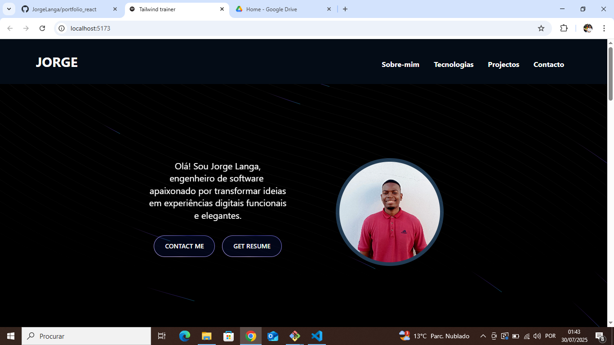

# Portfolio React

Este é um portfólio pessoal desenvolvido com React e Vite, projetado para apresentar projetos, habilidades, informações pessoais e formas de contato de maneira moderna e interativa.

## Funcionalidades
- Página inicial com apresentação
- Seção "Sobre" com detalhes pessoais
- Listagem de projetos realizados
- Tecnologias utilizadas
- Página de contato
- Animações e efeitos visuais

## Estrutura do Projeto
```
eslint.config.js
index.html
package.json
README.md
tsconfig.app.json
tsconfig.json
tsconfig.node.json
vite.config.ts
public/
src/
  App.tsx
  index.css
  main.tsx
  assets/
  components/
  img/
  lib/
  pages/
  types/
```

## Tecnologias Utilizadas
- React
- TypeScript
- Vite
- Tailwind CSS
- GSAP (animações)

## Como Executar
1. Instale as dependências:
   ```bash
   npm install
   ```
2. Inicie o projeto:
   ```bash
   npm run dev
   ```
3. Acesse `http://localhost:5173` no navegador.

## Autor
- Jorge Langa
- [LinkedIn](https://www.linkedin.com/in/jorge-langa)
- [GitHub](https://github.com/JorgeLanga)

## Preview



## Deploy
O projeto está disponível online em: [https://portfolio-react-phi-kohl.vercel.app/]
## Créditos

- Tecnologias: Vite, Tailwind CSS, React, Magic UI, aceternity UI

## Licença
Este projeto está sob licença MIT.
